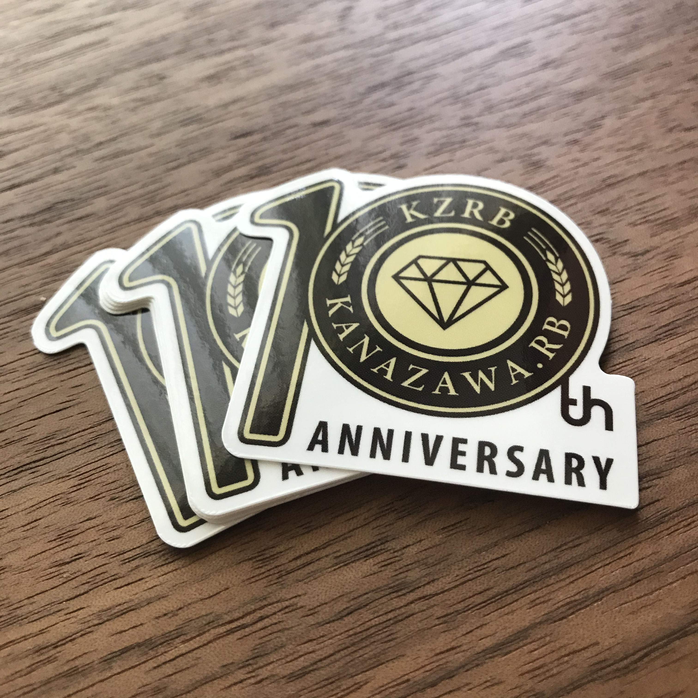

---

layout: record
title: "#120"
published: true

---

<!--

終了後記入

<a href="./report.html"><strong>イベントは終了しました。レポートはこちら</strong></a>

-->

<a class="doorkeeper-registration-widget" href="https://kzrb.doorkeeper.jp/events/141516">kanazawa.rb meetup #120</a>

# meetup #120

## 内容「祝10周年 LT大会」

なんでもいいのでYou、話しちゃいなよ！！ 参加者全員が「どんな内容でも良いので」参加者に向けて発表することを目標にしています。
感染症対策を十分におこなった上で、対面イベントとして実施いたします。

kanazawa.rb もついに10周年を迎えることとなりました。この10年、とくにここ数年の間にコミュニティを取り巻く環境は大きく変化し、これからも変化せざるを得ない状況が続きそうです。そんな中でも、交流を求める参加者全員の思いが10年という節目を迎えさせてくれました。
10周年の記念として、いつも運営にご協力いただいている [15VISION](https://15vision.jp/) の [いちがみさん](https://twitter.com/ichigami/) にお手伝いいただき、特別なステッカーを用意しています。

参加者全員にお配りしますので、是非一緒にこの記念をお祝いしてください！

なお、9周年の時に用意した特別デザインのTシャツも引き続きお買い求めいただけます。
10周年を祝うひとつの形として、是非ご購入を検討いただければと！

<table>
<tr>
<td>

記念Tシャツ（通常版）

</td>
<td>

記念Tシャツ（寄付版※） 

</td>
</tr>
</table>

Tシャツはいくつかのカラーバリエーションがあり、サイズも選択可能です。
また、Tシャツ以外にもいくつかの記念品を用意しています。
是非、以下のサイトをチェックしてみてください！

[https://suzuri.jp/kzrb](https://suzuri.jp/kzrb)

<small>※商品名に Donation とあるものは寄付版です。寄付版は、kanazawa.rb の運営費をサポートするモデルとなります。商品自体に差はありません。</small>

| **日時**   | 2022年08月27日(土) 13:00 - 17:00 |
| **会場**   | [ITビジネスプラザ武蔵](http://www.bp-musashi.jp/) 研修室1 金沢市武蔵町14番31号 |
| **参加費** | 500円 |

* **参加費** は会場代および空調代に充てます。
* 参加費は、当日に現地で回収致します。 現金、Kyash、PayPay のいずれかでお支払いになります。現金の方はお釣りの出ないようご協力お願いします。なお、領収証は発行されません。
* 割引制度があります。「学生の方」「女性の方」「県外からの参加者で且つ何らかの発表を行った方」の参加費は無料となります。
* テキストチャットルームも活用します。
    * 発表に対するフィードバックや URL の共有等に利用します。
    * Slack というサービスの [kanazawa.rb 用ワークスペース内](https://kzrb.slack.com/) にある `#meetup120` チャネルにご参加ください。
    * アカウントの新規発行をご希望の方は [こちら](https://kzrb-slackin.herokuapp.com/) から登録ください。
    * Slack はイベントを補助するものであり、本 meetup への参加に Slack 登録は必須ではありません。

## ざっくりタイムテーブル

| タイトル                          | 時刻  | 時間 | 担当                                                    |
|:----------------------------------|:-----:|:----:|:--------------------------------------------------------|
| 開場                              | 13:00 |      |                                                         |
| オープニング＆発表順決定          | 13:15 | 30m  | みんな                                                  |
| LT                                | 13:45 |      | みんな                                                  |
| 運営ブレスト                      | 16:25 | 30m  | 有志                                                    |
| 片付け＆撤収                      | 16:55 | 5m   | みんな                                                  |

## LTについて

* Lightning Talks または Lightweight Talks
* 1人1本以上持参
* 1本 **5分以内** 厳守

**完成度は問いません！**

LTを難しく考えすぎていませんか？
LTは高い技術力を持った人が笑いを取りながらハックした成果を発表する場と思い込んでいませんか？
そんなことはありません！
少なくとも kanazawa.rb の LT は **なんだっていいよ！**
kanazawa.rb はカンファレンスでも勉強会でもない！
スライドなんかなくたっていい！

あなたの話はあなたにしかできません。これ、ほんと。
みんながスピーカーでみんながオーディエンス。みんな同じ。
大事なことなのでもう一度。
**みんな同じ。** 遠慮も畏れも要らない。

ここまで言ってもどうしてもどうしてもLTできないという人、構わんから来て。

### テーマ

* この1年でやったこと / この1年で忘れたこと
* 今年の抱負
* 仕事のこと
* 読んだ本の感想
* ペット自慢
* **その他自由**

**つ ま り 自 由**

### 発表内容の事前共有について

必須ではありませんが、参加される方はどんな内容を話すかを事前に表明してもらえると助かります。
以下いずれかの方法でお願いします。

* Twitter 上 [#kzrb](http://twitter.com/search?q=%23kzrb) というハッシュタグをつけてツイートする
* 前述 Slack の `#meetup120` というチャネルで書き込みをする

## ポジションペーパーについて

当日は初めて会う人もたくさんいると思います。

そこでポジションペーパーの作成をオススメします。ポジションペーパーを用意しておくことで自己紹介がスムーズになりますし、「こういうことやってる人がいるのか。この話を質問してみたい。」「こういうことやりたい人がいるなら、これが一緒にできるかも。」といったことも考えやすくなります。

当日のディスカッションや次回以降のネタを考える弾みになりますので、できるだけ事前に作成しておいてもらえると嬉しいです。どのような形で作ってもらっても結構ですが、permalink があるとお互いに便利だと思います。

### テンプレート

gist用のテンプレートも用意しました。forkして書き換えるだけで使えるので便利！

- [Kanazawa.rb ポジションペーパー テンプレート on Gist](https://gist.github.com/5a523ec3180002229a32)

**もちろん gist でなくても大丈夫です。** twitter の bio よりちょっと詳しい程度の情報があればだいぶイメージしやすいんじゃないかと思います。

## 補足

- 一応WiFiがありますが、人数が多くなるとパンクします＞＜
- 電源は十分なクチがないので、 **タップを持参** してもらえると嬉しいです。特に **Mac の人はアダプタが干渉しやすい** ので注意！
- 遅刻しないでもらえると嬉しいけど、途中の出入りは自由です。
