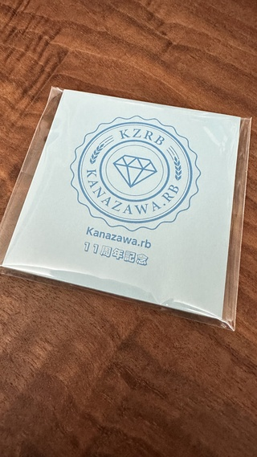

---

layout: post
title: "Meetup #132"
nav_exclude: true
published: true
number: 132
next: true
prev: true

---



# Meetup #132

## 内容「祝11周年 LT大会」 (オフライン開催)

なんでもいいのでYou、話しちゃいなよ！！ 参加者全員が「どんな内容でも良いので」参加者に向けて発表することを目標にしています。
感染症対策を十分におこなった上で、対面イベントとして実施いたします。

コミュニティを取り巻く環境が激動の中にあっても、交流を求める開発者が寄り添った結果 kanazawa.rb は11周年を迎えることとなりました。
Rubyだけでなく、さまざまな情報を交換する場として、これまでもこれからも心地の良い場所として提供し続けられたらと思います。

11周年のノベルティグッズとして、ポストイットをご用意しています。

参加者全員にお配りしますので、是非一緒にこの記念をお祝いしてください！

※今回のノベルティは [@Yukimitsu\_Izawa](https://twitter.com/Yukimitsu_Izawa/) さんにご寄付いただきました

なお、9周年の時に用意した特別デザインのTシャツも引き続きお買い求めいただけます。
活動の支援にもなりますので、是非ご購入を検討いただければと！

<table>
<tr>
<td>

記念Tシャツ（通常版）

</td>
<td>

記念Tシャツ（寄付版※） 

</td>
</tr>
</table>

Tシャツはいくつかのカラーバリエーションがあり、サイズも選択可能です。
また、Tシャツ以外にもいくつかの記念品を用意しています。
是非、以下のサイトをチェックしてみてください！

[https://suzuri.jp/kzrb](https://suzuri.jp/kzrb)

<small>※商品名に Donation とあるものは寄付版です。寄付版は、kanazawa.rb の運営費をサポートするモデルとなります。商品自体に差はありません。</small>

記念Tシャツの詳細は[こちら](https://meetup.kzrb.org/120/)のイベントページを参照ください。

| **日時**   | 2023年08月26日(土) 13:00 - 17:00 |
| **会場**   | [ITビジネスプラザ武蔵](http://www.bp-musashi.jp/) 研修室2 金沢市武蔵町14番31号 |
| **参加費** | 500円 |

* **参加費** は会場代および空調代に充てます。
* 参加費は、当日に現地で回収致します。 現金、Kyash、PayPay のいずれかでお支払いになります。現金の方はお釣りの出ないようご協力お願いします。なお、領収証は発行されません。
* 割引制度があります。「学生の方」「女性の方」「県外からの参加者で且つ何らかの発表を行った方」の参加費は無料となります。

## 発表時の資料の投影について

発表時に資料を利用する方はふたつの方法から選択いただけます

1. プロジェクタを使って投影する
    * HDMI ケーブルで接続するものになりますので、利用を想定される方はアダプタ等の準備をお願いします
2. Zoom というアプリケーションを使って画面共有する
    * 発表者の画面を配信していただき、参加者が視聴する形となります
    * 事前に Zoom アプリケーションをインストールしておくようお願いします
    * 配信先となる具体的な設定(URL 等)は当日イベント中に調整させていただきます

## チャットルームについて

* テキストチャットルームも活用します。
    * 発表に対するフィードバックや URL の共有等に利用します。
    * Slack というサービスの [Kanazawa.rb 用ワークスペース内](https://kzrb.slack.com/) にある `#meetup132` チャネルにご参加ください。
    * アカウントの新規発行をご希望の方は [こちら](https://join.slack.com/t/kzrb/shared_invite/zt-1f4tcvoud-w5whpsFrRpFyFHisVpyMCA) から登録ください。
    * Slack はイベントを補助するものであり、本 meetup への参加に Slack 登録は必須ではありません。

## ざっくりタイムテーブル

| タイトル                          | 時刻  | 時間 | 担当                                                    |
|:----------------------------------|:-----:|:----:|:--------------------------------------------------------|
| 開場                              | 13:00 |      |                                                         |
| オープニング＆発表順決定          | 13:15 | 30m  |                                                         |
| LT 発表                           |       |      |                                                         |
| 人生で一番苦労したプロジェクトの話 | | | kanontonto1010 |
| 俺とキャンプ | | | satoru.takeuchi |
| 外来語の話 | | | jun.nakano |
| 最近のwtnabeのあれやこれや | | | wtnabe |
| 推しの VTuber の公式 Web サイトを作った Part.2 | | | kanontonto1010 |
| 最近作っていたもの | | | takayukiatkwsk |
| Espressif ZeroCodeを試してみた' | | | issekiamp |
| 形式仕様言語TLA+ | | | satoru.takeuchi |
| 形式仕様言語TLA+ その2 | | | satoru.takeuchi |
| *POSIX文字クラスでの躓き* | | | muryoimpl |
| *俺とTODOアプリ* | | | muryoimpl |
| PropshaftとSprocketsの違い - なぜPropshaftなのか -' | | | nagutabby |
| AI + cli | | | kiyohara |
| 近況をお話しします | | | kanontonto1010 |
| Espressif ZeroCode 実演リベンジ | | | issekiamp |
| 運営ブレスト                      | 16:25 | 30m  | 有志                                                    |
| 片付け＆撤収                      | 16:55 | 5m   | みんな                                                  |

**Meetup #132では、全員が LT でなにか発表することを目標にしています！どんな内容でもよいので、是非なにかひとつテーマを持って来てください。**

LT を実施するので恒例の自己紹介タイムは端折ります。

## LT について

* Lightning Talks または Lightweight Talks
* 1人1本以上持参
* 1本 **5分以内** 厳守

**完成度は問いません！**

LTを難しく考えすぎていませんか？
LTは高い技術力を持った人が笑いを取りながらハックした成果を発表する場と思い込んでいませんか？
そんなことはありません！
少なくとも Kanazawa.rb の LT は **なんだっていいよ！**
Kanazawa.rb はカンファレンスでも勉強会でもない！
スライドなんかなくたっていい！

あなたの話はあなたにしかできません。これ、ほんと。
みんながスピーカーでみんながオーディエンス。みんな同じ。
大事なことなのでもう一度。
**みんな同じ。** 遠慮も畏れも要らない。

ここまで言ってもどうしてもどうしても LT できないという人、構わんから来て。

### テーマ

* この1年でやったこと / この1年で忘れたこと
* 今年の抱負
* 仕事のこと
* Ruby でこんなことできました / Ruby のここキモくないですか
* 読んだ本の感想
* ペット自慢
* **その他自由**

**つ ま り 自 由**

## ポジションペーパーについて

当日は初めて会う人もたくさんいると思います。

そこでポジションペーパーの作成をオススメします。ポジションペーパーを用意しておくことで自己紹介がスムーズになりますし、「こういうことやってる人がいるのか。この話を質問してみたい。」「こういうことやりたい人がいるなら、これが一緒にできるかも。」といったことも考えやすくなります。

当日のディスカッションや次回以降のネタを考える弾みになりますので、できるだけ事前に作成しておいてもらえると嬉しいです。どのような形で作ってもらっても結構ですが、permalink があるとお互いに便利だと思います。

### テンプレート

Gist 用のテンプレートも用意しました。fork して書き換えるだけで使えるので便利！

- [Kanazawa.rb ポジションペーパー テンプレート on Gist](https://gist.github.com/5a523ec3180002229a32)

**もちろん Gist でなくても大丈夫です。** Twitter の bio よりちょっと詳しい程度の情報があればだいぶイメージしやすいんじゃないかと思います。

## 補足

- 一応WiFiがありますが、人数が多くなるとパンクします＞＜
- 電源は十分なクチがないので、 **タップを持参** してもらえると嬉しいです。特に **Mac の人はアダプタが干渉しやすい** ので注意！
- 遅刻しないでもらえると嬉しいけど、途中の出入りは自由です。
