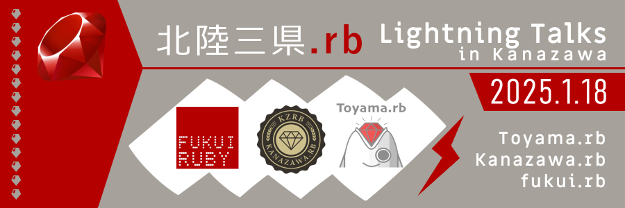

---

layout: post
title: "北陸三県.rb Lightning Talks in Kanazawa"
nav_exclude: true
published: true
number: 149
#next: true
prev: true

---

<!--
  - イベント参加者の募集
    - している時: is_event_open_or_closed="open"
    - していない時: is_event_open_or_closed="closed"
  - Doorkeeperのイベントページ
    - ある時: doorkeeper_url="<ここにURLを入力>"
    - ない時 <何も書かない>

is_event_open_or_closed="closed"の時にreport.mdがあればレポートページのリンクが表示される
-->



# 北陸三県.rb Lightning Talks in Kanazawa

## 概要

北陸三県で活動する三つの Ruby コミュニティが合同イベントを開催いたします。

* Toyama.rb ... [https://toyamarb.github.io/](https://toyamarb.github.io/) (富山県)
* Kanazawa.rb ... [https://kzrb.org/](https://kzrb.org/) (石川県)
* fukui.rb ... [https://fukuirb.connpass.com/](https://fukuirb.connpass.com/) (福井県)

※都道府県コード順

地域コミュニティの垣根を越え、普段より少し広い世界に交流を広げてみませんか？
本イベントは「交流」をテーマと考えています。
同じものに興味を持つ「新しい仲間」にきっと出会えます！！

| **日時**   | 2025年01月18日(土) 13:00 - 17:00 |
| **会場**   | [ITビジネスプラザ武蔵](http://www.bp-musashi.jp/) 研修室1 金沢市武蔵町14番31号 |
| **参加費** | 500円 |

## 内容

内容は LT (Lightning Talks) 大会。
5分以内という短い発表を「スピーディーに沢山」行うイベントとなっています。
参加者から LT 発表者を募る形で実施し、ご連絡いただければどなたでも発表いただけます。

自分の考えている事を発信することで、交流の輪を広げていきましょう！

発表内容に強い制限はありません。どんな内容でもかまいません。

1点だけ、「 **あなたが** エンジニアコミュニティの参加者が興味を持つと思ったテーマ」でお願いします。
Ruby やプログラミングに関する発表はもちろんのこと、例えば「おうちIoT」とか「今年の抱負」とか「AI とテキストエディタ」等など、なんでもありです！

※後述の禁則事項には目を通していただきますようお願い致します。

## ざっくりタイムテーブル

| タイトル                          | 時刻  | 時間 | 担当                                                    |
|:----------------------------------|:-----:|:----:|:--------------------------------------------------------|
| 開場                              | 13:00 |      |                                                         |
| オープニング                      | 13:15 | 5m   |                                                         |
| Tor Tails | | | くろねこ |
| OpenSCADはじめました | | | noboru_i |
| Effective Jekyll | | | wtnabe |
| ヨシケイの取り忘れを対策した | | | cotton |
| 休憩 | | | |
| RubyでXDPプログラミング | | | yuki |
| ただの自己紹介と近況報告 | | | junya-shimazu |
| Kanazawa.rbのLT大会を支える技術の裏側を変更する | | | muryoimpl |
| SF Bay Area Ruby Meetupから考えるRubyとmeetup | | | keiko713 |
| 休憩 | | | |
| 一緒に働く人と一緒にリリースノートを読もう | | | taiju |
| 読めるかな？ちょっとレアなRubyの記法 | | | kiyohara |
| 俺とバー/QRコードリーダ | | | pharaohkj |
| EnvoyのWasm filterを体験する | | | takayukiatkwsk |
| 休憩 | | | |
| IPAddr 2024 | | | t.taketo1113 |
| 富山Ruby会議01 をふりかえる | | | kunitoo |
| 俺とRubyの昔話 | | | yamada.hirotak |
| 令和7年版 あなたが使ってよいフロントエンド技術とは | | | mugi.uno |
| 休憩 | | | |
| 北陸新幹線乗車中のモバイル回線の通信速度を可視化してみた | | | bohemian916 |
| RubyでKubernetesプログラミング | | | satoru.takeuchi |
| 5 min Jekyll/Liquid Plugin cooking | | | wtnabe |
| 俺とメールへのリンク | | | pharaohkj |
| 休憩 | | | |
| 海外新卒と一緒に働く | | | taiju |
| 先ほどのつづきを… | | | kiyohara |
| Arch Linuxを使おう | | | くろねこ |
| 挨拶＆片付け                      | 17:10 | 10m  |                                                         |
| 雑談タイム                        | 17:20 | 20m  |                                                         |

## 懇親会について

本イベントの参加者が交流を深める場として懇親会を用意しております。

[こちら](https://kzrb.doorkeeper.jp/events/180431) の申込みページから内容ご確認の上、お申し込みいただければ幸いです。

## 禁則事項

本イベントでは、すべての参加者が安全で快適に過ごせる環境を目指しています。以下の行為を禁止します：

- **差別やハラスメント**：性別、年齢、人種、宗教、性的指向などに基づく差別的または攻撃的な言動。
- **暴力や脅迫**：他者を脅迫したり暴力を振るう行為。
- **過剰な宣伝行為** : 過度な製品やサービスの宣伝。許可のないビジネスや勧誘行為。
- **無許可の録音・撮影**：他者の許可なく録音、写真撮影、または動画撮影を行う行為。
- **進行妨害**：イベントの進行を妨げる行為。
- **違法または危険な行為**：違法薬物の使用、過度の飲酒、危険物の持ち込みなど。
- **その他の迷惑行為**：他者を不快にさせる言動や施設を損傷する行為。

## 違反行為への対応

上記の行為が発覚した場合、以下の対応を取る場合があります：

- 警告または即時退場（返金不可）。
- 必要に応じた法的措置。

## 問題が発生した場合

問題や不快な状況に遭遇した場合は、速やかにスタッフまでお知らせください。

みなさまのご協力をよろしくお願いいたします。

