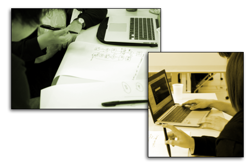

---

layout: default
title: "#26"
date: 2014-10-11 (Sat)

---

<a href="./report.html"><strong>イベントは終了しました。レポートはこちら</strong></a>

<a class="doorkeeper-registration-widget" href="http://kzrb.doorkeeper.jp/events/15503">meetup
#26</a>

meetup #26
===========

Coderetreat mini in Kanazawa.rb

[Coderetreat - Honing the craft together worldwide](http://coderetreat.org/)

Coderetreat
はソフトウェアの開発と設計の基礎を学ぶことを目的とした、プログラマのための「練習」のイベントで、世界的に行われているものです。

本来の Coderetreat は丸一日掛かりのイベントですが、今回は Coderetreat
mini と称して Kanazawa.rb
のいつものタイムスケジュールに合わせた形で、コンパクトにやってみようという初めての試みになります。

「プログラミング」の「実地練習」をみんなで楽しみましょう！

| 日時   | 2014年 10/11(土) 13:00 〜 17:00 |
| 会場   | ITビジネスプラザ武蔵 研修室2 金沢市武蔵町14番31号 <a href="http://www.bp-musashi.jp/">http://www.bp-musashi.jp/</a> |
| 参加費 | 500円 |

**参加費** は会場代および空調代、お菓子、飲み物に充てます。現場で
**現金** で回収しますので、お釣りの出ないようご協力お願いします。

Coderetreat miniの主な内容と基本ルール
--------------------------------------

* ペアプログラミングを行う
* お題は [コンウェイの「ライフゲーム」](http://coderetreat.org/gol) 【参考】 [ライフゲーム - Wikipedia](http://ja.wikipedia.org/wiki/%E3%83%A9%E3%82%A4%E3%83%95%E3%82%B2%E3%83%BC%E3%83%A0)
* 45分/セッション x 3
* ペアはセッションごとに交代
* 成果物はセッションごとに破棄
* 対応言語は Kanazawa.rb らしくいったん **Java or Ruby** とします
* 事前アンケートで他の言語の希望が多ければ対応を考えます

また以下のような練習をすることが推奨されています。

* データ構造などの設計のディスカッション
* テスト駆動開発
* ifやループを使わない実装
* 1メソッド5行未満

ざっくりタイムテーブル
----------------------

 |時間            |内容                     |人|
 |----------------|-------------------------|----------------------------------------|
 |13:00           |受付                     ||
 |13:10           |meetupイントロ           ||
 |13:15 〜 13:30  |Coderetreatイントロ      |[@kompiro](https://twitter.com/kompiro)|
 |13:30 〜 14:15  |ペアプロ　セッション#1   |みんな|
 |14:15 〜 14:30  |ふりかえり#1             |みんな|
 |14:30 〜 14:40  |休憩                     |みんな|
 |14:40 〜 15:25  |ペアプロ　セッション#2   |みんな|
 |15:25 〜 15:40  |ふりかえり#2             |みんな|
 |15:40 〜 15:50  |休憩                     |みんな|
 |15:50 〜 16:35  |ペアプロ　セッション#3   |みんな|
 |16:35 〜 16:50  |ふりかえり#3             |みんな|
 |16:50 〜 17:00  |片付け＆撤収             |みんな|

事前準備のお願い
----------------

今回は実際にプログラミングを行うイベントになりますので、各自開発環境を持参してください。これは実際に開発できる状態のPCを持参するという意味になります。言語、エディタ、IDE、テスティングフレームワークなどが実際に動く状態のものを用意してください。当日準備する時間的な余裕はありませんのでご協力お願いします。

例えば Ruby なら bundle install
済みの状態を用意して、それをコピーしてセッションを開始するようにすると、とてもスムーズです。

また会場に WiFi
はありますが、参加人数によっては全員が同時に負荷の高い通信を行うことは難しくなります。インターネットに優しくできるように、リファレンスの準備などもお願いします。画面を効率的に活用できるので書籍もとても有効です。

ポジションペーパーについて
--------------------------

当日は初めて会う人もたくさんいると思います。

そこでポジションペーパーの作成をオススメします。ポジションペーパーを用意しておくことで自己紹介がスムーズになりますし、「こういうことやってる人がいるのか。この話を質問してみたい。」「こういうことやりたい人がいるなら、これが一緒にできるかも。」といったことも考えやすくなります。

当日のディスカッションや次回以降のネタを考える弾みになりますので、できるだけ事前に作成しておいてもらえると嬉しいです。どのような形で作ってもらっても結構ですが、permalink
があるとお互いに便利だと思います。

### テンプレート

gist用のテンプレートも用意しました。forkして書き換えるだけで使えるので便利！

* [Kanazawa.rb ポジションペーパー テンプレート — Gist](https://gist.github.com/5a523ec3180002229a32)

**もちろん gist でなくても大丈夫です。** twitter の bio
よりちょっと詳しい程度の情報があればだいぶイメージしやすいんじゃないかと思います。

補足
----

* 当日は PC を持参してきてください。今回はハンズオンです。
* 電源タップも重宝します。お持ちの方はぜひご協力をお願いします。
* ペアプログラミングを行いますので、遅刻されるとセッションの途中から参加することは難しいです。寝坊注意！
