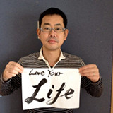

---

layout: post
nav_exclude: true
title: "#7"
number: 7
next: true
prev: true
---

<a href="/7/report"><strong>イベントは終了しました。レポートはこちら</strong></a>

<a href="http://kzrb.doorkeeper.jp/events/3033" class="doorkeeper-registration-widget">meetup
#7</a>

meetup #7
==========

Agile x Kanazawa.rb

時々見かけるアジャイルって何？と思っているあなた。そんなあなたに朗報です！
今回のmeetupではアジャイルの概要と事例を、そして見える化とプロジェクトファシリテーションを、「本物」から学べちゃいます！
今回はまさかの平鍋祭り！ そして LT 祭りの豪華2本立て！

またとないこのチャンス、聞くだけじゃもったいない！ ぜひあなたも LT
してみませんか？ Kanazawa.rb の LT
は5分という時間以外はフリーダム。一緒に楽しんじゃいましょう！

| 日時   | 2013年 3/30(土) 13:00 〜 17:00 |
| 会場   | ITビジネスプラザ武蔵 研修室2 金沢市武蔵町14番31号 <a href="http://www.bp-musashi.jp/">http://www.bp-musashi.jp/</a> |
| 参加費 | 500円 |

**参加費** は会場代および空調代に充てます。現場で **現金**
で回収しますので、お釣りの出ないようご協力お願いします。

ざっくりタイムテーブル
----------------------

 |時間            |内容                                          |人|
 |----------------|----------------------------------------------|------------------------------------------|
 |13:00           |開場                                          ||
 |13:10 〜 13:15  |Intro                                         |[@wtnabe](https://twitter.com/wtnabe)|
 |13:15 〜 13:45  |自己紹介                                      |みんな|
 |13:45 〜 15:45  |アジャイルプラクティスとわくわくする現場作り  |[@hiranabe](https://twitter.com/hiranabe)|
 |15:45 〜 16:00  |休憩                                          ||
 |16:00 〜 16:50  |フリータイム & LT                             |みんな|
 |16:55 〜        |撤収                                          ||

※ メインセッションの2時間中に休憩、質疑の時間を含みます。

### LT登壇リスト

- うばた(@jaVuBax) : そうだ京都へ行こう
- たちばな(@toybox\_design) : Compass で遊ぼう
- いざわ(@Yukimitsu\_Izawa) : Rubyでトライ！
- おかもと(@haraguro3) : UML使いませんか
- ささき(@shirokuro331) : (´・ω・`)人(´・ω・`)ﾙﾋﾞｰ
- かとう(@PharaohKJ) : 俺とアジャイル
- かわぐち(@kawaguti) : So, Agile is what ?

セッション概要 「アジャイルプラクティスとワクワクする現場作り」
---------------------------------------------------------------

現在注目をあつめている「アジャイル開発」の概要を、
日本での事例やデータを交えながら、歴史と最新動向も含めて紹介します。また、より普遍的な課題であるプロジェクトの運営、チーム作りについて、アジャイル開発とトヨタ生産方式の見える化手法を使って、現場のモチベーションを高め、生産性をアップする
「プロジェクトファシリテーション」を解説します。
みなさんの開発現場を、ワクワクするチームに変えて行きませんか？

ゲストプロフィール
------------------

**平鍋　健児（ひらなべ　けんじ）**

株式会社チェンジビジョン代表取締役社長、永和システムマネジメント副社長。
オブジェクト指向技術、アジャイル開発、ファシリテーションのコンサルタントをしています。

自分でオブジェクト指向開発を実践していく過程で、テクノロジーからプロセスへ、そしてピープルへとその興味が移っていきました。現在は、「アジャイルな」すべてのものを志向しています。最近の仕事は、マインドマップとUMLの融合エディタ、astah*(アスター、旧JUDE)の開発。新しいアイディアの可能性への挑戦です。

  
  
  

翻訳書として、『アジャイルプロジェクトマネジメント』、『リーンソフトウェア開発』やXP関連の書籍が多数あります。新刊『アジャイル開発とスクラム～顧客・技術・経営をつなぐ協調的ソフトウェア開発マネジメント』では、野中郁次郎先生と共著で、日本の文化的な底力とソフトウェア開発について考察しています。
福井県大野市に住み、お酒と映画とJazzを愛しています。

-   Twitter <https://twitter.com/hiranabe>
-   Blog <http://blogs.itmedia.co.jp/hiranabe/>

<!-- -->

-   株式会社チェンジビジョン <http://www.change-vision.com/>
-   永和システムマネジメント <http://www.esm.co.jp/>

ポジションペーパーについて
--------------------------

当日は初めて会う人もたくさんいると思います。

そこでポジションペーパーの作成をオススメします。ポジションペーパーを用意しておくことで自己紹介がスムーズになりますし、「こういうことやってる人がいるのか。この話を質問してみたい。」「こういうことやりたい人がいるなら、これが一緒にできるかも。」といったことも考えやすくなります。

当日のディスカッションや次回以降のネタを考える弾みになりますので、できるだけ事前に作成しておいてもらえると嬉しいです。どのような形で作ってもらっても結構ですが、permalink
があるとお互いに便利だと思います。

### テンプレート

gist用のテンプレートも用意しました。forkして書き換えるだけで使えるので便利！

* [Kanazawa.rb ポジションペーパー テンプレート — Gist](https://gist.github.com/5a523ec3180002229a32)

**もちろん gist でなくても大丈夫です。** twitter の bio
よりちょっと詳しい程度の情報があればだいぶイメージしやすいんじゃないかと思います。

補足
----

* 当日は PC を持参してきても持参してこなくても大丈夫です。
* 一応WiFiがありますが、人数が多くなるとパンクします＞＜
* 電源は十分なクチがないので、 **タップを持参** してもらえると嬉しいです。特に **Mac の人はアダプタが干渉しやすい** ので注意！
* 最初に自己紹介するので遅刻しないでもらえると嬉しいけど、途中の出入りは自由です。

PC使って喋りたい人はちゃんとプロジェクタに繋がるように準備してきてね！
