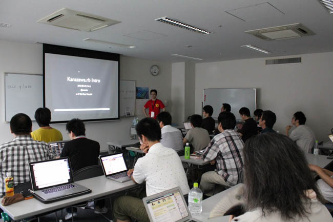
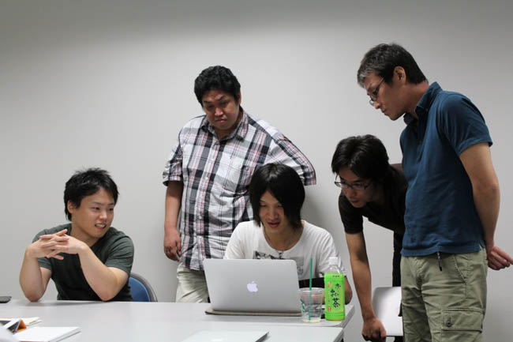
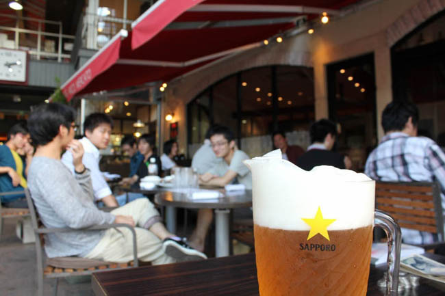
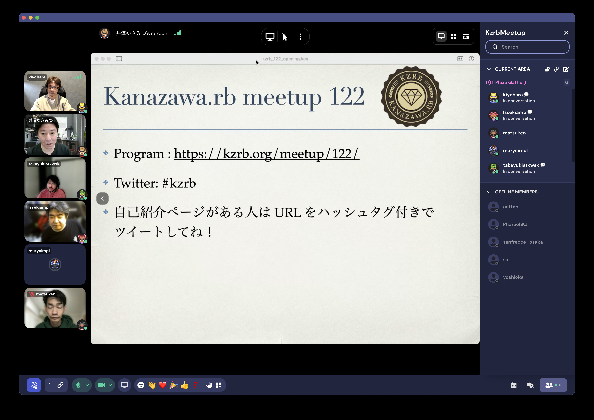
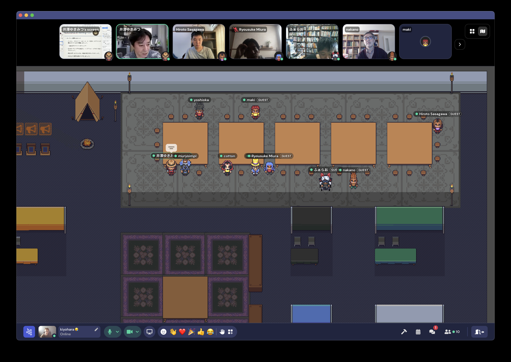

  
注目

  <a href="/158" class="home__latest-meetup-link">
    最新の Meetup#158 はこちらへ
  </a>

  <a href="./howto-make-meetup">→ How to make meetup</a>
   
  <a href="./slides">→ Kanazawa.rb Slides</a>

Let’s meet up !
===============

ネット上には様々な情報が溢れています。Ruby
に関する情報は世界中の人々が発信しており、一日中 PC
を開いてネットに向かっていたとしても追いつくことができないほどです。

コロナ禍を経験し、人と接することを何かしら制限した世界で、ひとりもくもくする時間も増えてきました。

でも、それで満足ですか？

**人が、そこに居る。**

この事実は思った以上に大きいです。存在そのものが持つ情報量はネット上に表すことができません。それを体感する方法は、今のところ同じ空間、同じ時間を顔を合わせて共有する以外にありません。

だから会うんです。

物理でもインターネット上のビデオチャットでも。

カモンジョイナス！ 来ちゃいなよ！

予定
----

基本は毎月第3土曜の予定ですが、ずれる時もあるのでご確認ください。

<iframe src="https://www.google.com/calendar/embed?height=600&amp;wkst=1&amp;bgcolor=%23FFFFFF&amp;src=b5bhu4mdb4me2g5d2ephdsvnbk%40group.calendar.google.com&amp;color=%231B887A&amp;ctz=Asia%2FTokyo" style=" border-width:0 " width="650" height="400" frameborder="0" scrolling="no">
</iframe>

ポジションペーパーについて
--------------------------

当日は初めて会う人もたくさんいると思います。

そこでポジションペーパーの作成をオススメします。ポジションペーパーを用意しておくとで自己紹介がスムーズになりますし、「こういうことやってる人がいるのか。この話を質問してみたい。」「こういうことやりたい人がいるなら、これが一緒にできるかも。」といったことも考えやすくなります。

当日のディスカッションや次回以降のネタを考える弾みになりますので、できるだけ事前に作成しておいてもらえると嬉しいです。どのような形で作ってもらっても結構ですが、permalink
があるとお互いに便利だと思います。

ポジションペーパーテンプレート
------------------------------

gist用のテンプレートも用意しました。forkして書き換えるだけで使えるので便利！

* [Kanazawa.rb ポジションペーパー テンプレート — Gist](https://gist.github.com/5a523ec3180002229a32)

**もちろん gist でなくても大丈夫です。** twitter の bio
よりちょっと詳しい程度の情報があればだいぶイメージしやすいんじゃないかと思います。

イメージ
--------

